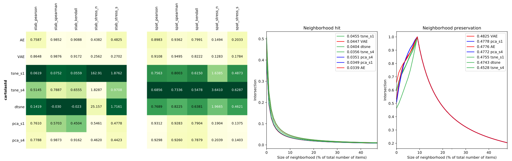
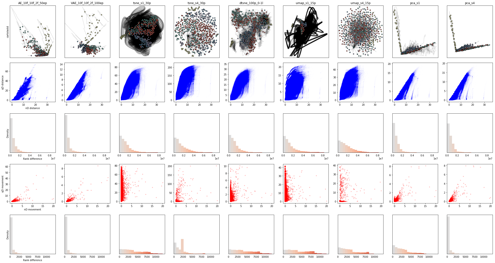
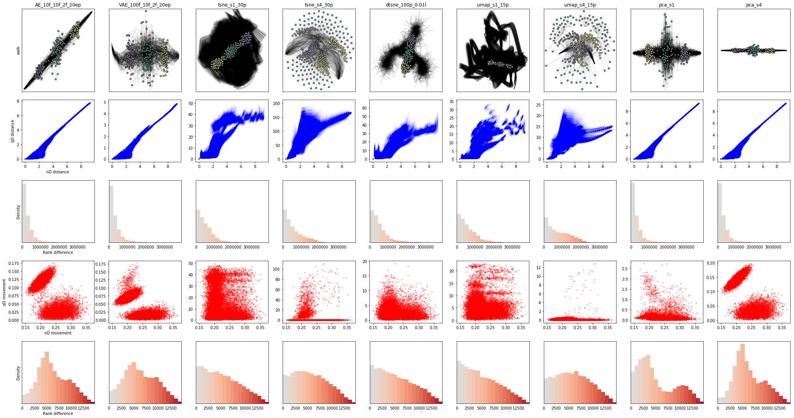

# Dynamic projections
E.F. Vernier,
R. Garcia,
I.P. Silva,
J.L.D. Comba,
A.C. Telea, and
L.G. Nonato

**Table of contents**

<!-- TOC depthFrom:2 depthTo:6 withLinks:1 updateOnSave:1 orderedList:0 -->

- [Introduction](#introduction)
- [Projection methods](#projection-methods)
- [Datasets](#datasets)
- [Metrics](#metrics)
- [Results](#results)
- [Recreating the results / Testing new methods and datasets](#recreating-the-results-testing-new-methods-and-datasets)
	- [Generating the projections](#generating-the-projections)
	- [Visualizing the projections](#visualizing-the-projections)
	- [Computing the metrics](#computing-the-metrics)
	- [Generating videos](#generating-videos)
	- [Plotting the metric results](#plotting-the-metric-results)
	- [Ploting static trail viz](#ploting-static-trail-viz)

<!-- /TOC -->

## Introduction
TODO

## Projection methods

TODO talk about implementation/source

**PCA** - The main linear technique for dimensionality reduction, principal component analysis, performs a linear mapping of the data to a lower-dimensional space in such a way that the variance of the data in the low-dimensional representation is maximized (TODO copied from wikipedia). Strategy 1 (pca_s1) computes PCA independently for each timestep. Strategy 4 (pca_s4) works by grouping all timesteps together and computing PCA once.

**t-SNE** - TODO

**dt-SNE** - TODO

**Autoencoders**
In the context of dimensionality reduction, you take an (usually) hourglass-shaped neural network and train it to basically reconstruct the input. After trained, the middle layer acts as a compact (latent) representation of the original data. The middle layer needs to have a number of neurons equivalent to the dimensionality of the space we want to project out data into. We tested 4 different "types" of autoencoders:

|       |                                                        |                                                                        |
|:-----:|:-------------------------------------------------------|:-----------------------------------------------------------------------|
|  AE   | _Dense autoencoders_                                   | Fully connected layers.                                                |
| C2AE  | _Convolutional autoencoders_                           | Used only on the image-based datasets.                                 |
|  VAE  | _Variational autoencoders with fully connected layers_ | trying to get better internal representations by avoiding overfitting. |
| C2VAE | _Variational autoencoders with convolutional layers_   | possibly better of both worlds regarding input reconstruction ability. |

TODO How to decode the names to understand number of layers, neurons per layer, epochs of training, etc.

## Datasets

The notebooks and files that generated the datasets are available [here](https://drive.google.com/drive/folders/1MXJK2mqH015pAohuBawVIQeqgB38JAsy?usp=sharing).

**1. cartolastd** - 696 observations - 19 timesteps - 17 dimensions - 5 classes -
[Video](Docs/videos/cartolastd-avi-10.avi)

The dataset was scrapped from the Brazilian fantasy soccer platform Cartola and represents the second turn of the 2017 championship. The scrapper source can be found at https://github.com/henriquepgomide/caRtola. To make the dataset smoother, the dimensions were cumulatively averaged.

**2. cifar10cnn** - 1000 observations - 30 timesteps - 10 dimensions - 10 classes -
[Video](Docs/videos/cifar10cnn-avi-10.avi)

I took the example CNN available at the keras website (https://keras.io/examples/cifar10_cnn/) and looked at the output of the last layer after each epoch for 1000 images of the validation set. After 30 epochs the CNN had an accuracy of 0.6950.

**3. esc50** - 320 observations - 108 timesteps - 128 dimensions - 8 classes -
[Example](Docs/images/esc50-wind.png) -
[Video](Docs/videos/esc50-avi-10.avi)

Sound samples of 8 classes (brushing_teeth, chainsaw, crying_baby, engine, laughing, rain, siren, wind) compressed to 128 frequencies and smoothed over time. Collected from https://github.com/karoldvl/ESC-50 by K. J. Piczak.

**4. fashion** - 1000 observations - 10 timesteps - 784 dimensions (28x28 pixels) - 10 classes -
[Example](Docs/images/fashion-observations.png) -
[Video](Docs/videos/fashion-avi-10.avi)

100 images from each class (T-shirt/top, Trouser, Pullover, Dress, Coat, Sandal, Shirt, Sneaker, Bag, Ankle boot) were selected and added decreasing amounts of noise.

**5. gaussians** - 2000 observations - 10 timesteps - 100 dimensions - 10 classes -
[Video](Docs/videos/gaussians-avi-10.avi)

Dataset from Rauber et. al's dt-sne paper. _“We create the multivariate Gaussians dataset specifically as a controlled experiment for dynamic t-SNE. Firstly, we sample 200 observations from each of 10 distinct (isotropic) 100-dimensional multivariate Gaussian distributions with variance 0.1. We combine the resulting 2000 observations into a single dataset D\[1\]. Each multivariate Gaussian has a distinct mean, which is chosen uniformly between the standard basis vectors for R 100 . Given D\[t\], the dataset D\[t + 1\] is created as follows. Each observation x\[t + 1\] ∈ D\[t + 1\] corresponds to an observation x\[t\] ∈ D\[t\] moved 10% of the remaining distance closer to the mean of its corresponding multivariate Gaussian. In simple terms, each of the 10 clusters becomes more compact as t increases. We consider T = 10 datasets.”_

**6. nnset** - 80 observations - 30 timesteps - 8070 dimensions - 8 classes -
[Example](Docs/images/nnset-states.png) -
[Video](Docs/videos/nnset-avi-10.avi)

This dataset represents the internal states (weights and biases) of a set of neural networks learning to classify MNIST with same architecture but using different optimizers, batch sizes, training data sizes. There doesn't seem to be clear class separation in this dataset.   

**7. qtables** - 180 observations - 40 timesteps - 1200 dimensions - 9 classes -
[Video](Docs/videos/qtables-avi-10.avi)

Each observation is an agent learning to move a car up a hill using the reinforcement learning algorithm Q-learning. The classes represent variations of learning rates and discounts. The car has 3 actions, and the space has 2 features, each divided into 20 discrete steps. Therefore the dataset is 3x20x20 or 1200 dimensions. Code based on this tutorial: https://pythonprogramming.net/q-learning-reinforcement-learning-python-tutorial/.

**8. quickdraw** - 600 observations - 89 timesteps - 784 dimensions (28x28 pixels) - 6 classes -
[Example](Docs/images/quickdraw-doodles.png) -
[Video](Docs/videos/quickdraw-avi-10.avi)
Google has a little fun project called Quick Draw (https://quickdraw.withgoogle.com/data). It’s a website where they give you a few seconds to draw some object while a neural network is trying to guess what is it that you are trying to draw. What I did was extract drawing sequences for 600 objects of 6 different classes drawn by random people. In my sample, each final drawing is composed of an average of 36.1 partial drawings. Each image is a 28x28 pixel binary map.

**9. sorts** - 80 observations - 100 timesteps - 100 dimensions - 8 classes -
[Example](Docs/images/sorts-imgs.png) -
[Video](Docs/videos/sorts-avi-10.avi)

Intermediate states of 8 sorting algorithms. Arrays initially have 100 random elements. Based on franciscouzo.github.io/sort/

**10. walk** - 300 observations - 50 timesteps - 100 dimensions - 3 classes -
[Example](Docs/images/walk-img.png) -
[Video](Docs/videos/walk-avi-10.avi)

There are 3 classes, in one the values of the dimensions start low and go high, one the values start high and decrease over time, and in the last, they stay roughly the same. For all of them there is noise added (see example). This is supposed to be a "ground-truth" dataset with simple dynamics.

**TABLE**

|    | dataset_id | n_items | n_timesteps | n_dims | n_classes |
|:---|:-----------|:--------|:------------|:-------|:----------|
| 1  | cartolastd | 696     | 19          | 17     | 5         |
| 2  | cifar10cnn | 1000    | 30          | 10     | 10        |
| 3  | esc50      | 320     | 108         | 128    | 8         |
| 4  | fashion    | 1000    | 10          | 784    | 10        |
| 5  | gaussians  | 2000    | 10          | 100    | 10        |
| 6  | nnset      | 80      | 30          | 8070   | 8         |
| 7  | qtables    | 180     | 40          | 1200   | 9         |
| 8  | quickdraw  | 600     | 89          | 784    | 6         |
| 9  | sorts      | 80      | 100         | 100    | 8         |
| 10 | walk       | 300     | 50          | 100    | 3         |

## Metrics
TODO - base off of a previous report.  

## Results

Here is the metric average for all dataset for each method.


Let's break this plot down. Light colors represent good metric results. The colormap was normalized independently by the min and max of each column. We removed convolutional autoencoders from this plot because they are only used in two datasets.

The leftmost block represents **stability** metrics. We can clearly see that, on average, pca_s4 and AE-based methods score very highly in this regard.  Predictably, tsne_s1, that is, tsne computed independently for each timestep, is the most unstable of the techniques.

The next two blocks relate to **spatial** metrics. The first one represents the ability of a method to preserve the distances from the nD space in mD, while the last block measures the ability to preserve neighbors in nD or members of the same class close together in mD.

Here the results surprised me. I always thought that PCA was pretty good at preserving distances, but if you want to better understand the nD neighborhoods, you would be better off with t-SNE. Our results confirms the first hypothesis, PCA (and AEs) are better than t-SNE at distance preservation, but, interestingly, t-SNE wasn't vastly superior than the other techniques regarding neighborhood preservation/hits.

So, very objectively, just looking at how light each row is, we can say that pca_s4 and AE/VAE are the best techniques for dynamic dimensionality reduction, as they score highly on all of our tested metrics.

Individual results of the same metrics for each dataset were also generated and are available [here](Plots/Figs/individual_plots.svg). Note in the example below (cartolastd) that the neighborhood hit/preservation metric is not averaged and we see the actual curves.



A more interesting look at the stability measurements of the same dataset is given below. Each column concerns one method. The first row shows the actual trails left by the moving points and their final positions. The second row is a plot showing the relationship of nD and mD movements for each point and each timestep. Ideally, we would want to see something resembling a diagonal straight line. The y axis is not normalized/standardized, maybe it should be. The last row is a histogram that represents the rank difference of the nD and mD movements. Ideally, we would want these differences to be minimized, that is, the k-th largest mD movement should correspond to the k-th largest nD movement. In this plot, this would be represented as a tall gray bar / middle bucket.



All datasets tell roughly the same story with one exception, the "walk" dataset. And I don't really understand why, the behavior seem in the [video](Docs/videos/walk-avi-10.avi) is exactly what I was expecting to see. The stability visualizations, however, tells us that, likely, different classes are moving at different rates. In the PCA and AE/VAE plots we see 2 movement clusters.



I decided to investigate this. I colored points by their class, same as in the previous image and first row. No pattern seen here.


Then I decided to color them by timestep using a colormap that goes from red to yellow to green. Now we see clear separation! With PCA/AE/VAE, points in the first timestep (red) that change the same amount in nD as the last timestep points (green), move very much less in the mD space. I am not sure why that is the case, any ideas? In any case, our metrics don't like that behavior.


**TODO Causes of unstable behavior**

pca s1


tsne s1


**TODO Causes of movement restriction**

See walk tsne s4.

**TODO Why pca s4 and AEs are stable**


## Recreating the results / Testing new methods and datasets
Set up virtual env and dependencies using pipenv. https://pipenv.readthedocs.io/en/latest/
```
pip install pipenv
pipenv run pip install pip==18.0
pipenv install
sudo apt-get install python3-tk
```
To run a script use `pipenv run python <script_name>.py`. To open notebooks use `pipenv run jupyter notebook` or create a new shell with `pipenv shell` and then call `jupyter notebook`.

### Generating the projections

**Autoencoders** ---  `./Models/ae`
The notebooks should contain information about training total time and performance metric (training/test accuracy and loss). The `Shared.py` file contains methods that might be useful for all notebooks and projection techniques e.g., saving projection, loading data.

**Dynamic/static t-sne** ---  `./Models/tsne`
From the root folder, we need to add the `tsne` folder to the PYTHONPATH and then run the dtsne_wrapper script.
```
export PYTHONPATH=${PYTHONPATH}:${PWD}/Models/tsne
python Models/tsne/dtsne_wrapper.py ./Datasets/gaussians 70 0.1
```
The default options are `n_epochs=200, sigma_iters=50`.

For static t-sne with strategies 1 and 4 (of the dt-sne paper):
```
export PYTHONPATH=${PYTHONPATH}:${PWD}/Models/tsne
python Models/tsne/tsne_s1.py ./Datasets/gaussians 70  # or
python Models/tsne/tsne_s4.py ./Datasets/gaussians 70
```

**Principal component analysis** ---  `./Models/pca`
```
export PYTHONPATH=${PYTHONPATH}:${PWD}/Models/
python Models/pca/pca_s1.py ./Datasets/gaussians  # or
python Models/pca/pca_s4.py ./Datasets/gaussians
```

**Formatting**

**Image datasets** -- The directory hierarchy doesn’t matter, all the metadata should be contained in the file name. `<class>-<id>-<time>.png`, e.g. `airplane-1234-10.png` -- 10th revision of airplane with id 1234.

**Tabular datasets** -- Each timestep is a single csv file named `<dataset_name>-<time>.csv`. The first column is the id and the next are the n features. I think this dtsne implementation only handles numerical features, so nothing categorical here for now.

**Output data (actual projections)** --- `./Output` -
Single csv file with information about the model in the name in the format `<dataset>-<model_info>.csv`, as in `quickdraw-AE_728c_200c_p_d_200f_500f_2f.csv`. The previous string is an hypothetical filename for the results of projection using an AE with two convolutional layers of 728 and 200 kernels each, followed by max pooling and dropout layers and three dense layers of 200, 500 and 2 neurons each. As for the contents of the file, the first column is the `id`, and the next are `t0d0, t0d1, ... t0dX, t1d0, ..., tTdX.` The number 't' is the timestep and 'd' is the representation dimension of each value.


### Visualizing the projections
There is a simple python tool based on matplotlib to quickly show and help us debug the generated projections. To use it, call
```
python Vis/Main.py ./Output/gaussians-pca_s4.csv ./Output/gaussians-AE_10f_2f_20ep.csv
python Vis/Main.py $(find Output/ -type f -name cartolastd*)
```

### Computing the metrics
The code for the metrics is located in a notebook called `template.ipynb`. For each dataset we use a tool called Papermill to instantiate a new notebook from the template. The two parameters that are needed are the output notebook path (remember to change name to dataset_id) and the list of output/projection files we want to analyse. This is the code that generates the analysis for the gaussians dataset:
```
papermill Metrics/template.ipynb ./Metrics/gaussians.ipynb --log-output -p projection_paths 'Output/gaussians-AE_10f_10f_2f_20ep.csv Output/gaussians-AE_10f_2f_20ep.csv Output/gaussians-tsne_s1_70p.csv Output/gaussians-tsne_s4_70p.csv Output/gaussians-dtsne_70p_0-1l.csv Output/gaussians-pca_s1.csv Output/gaussians-pca_s4.csv'
```
The results are written in a csv file that goes into the `./Metrics/Results` directory.
To check the (tqdm) progress see the `log_<dataset_id>` file in real time.

### Generating videos

```
papermill Plots/trails-video.ipynb Plots/temp.ipynb --log-output -p dataset_id gaussians
```

### Plotting the metric results
Simply run the `Plots/plots.ipynb` notebook.

### Ploting static trail viz
```
papermill Plots/trails-image.ipynb Plots/temp.ipynb --log-output -p dataset_id gaussians
```
